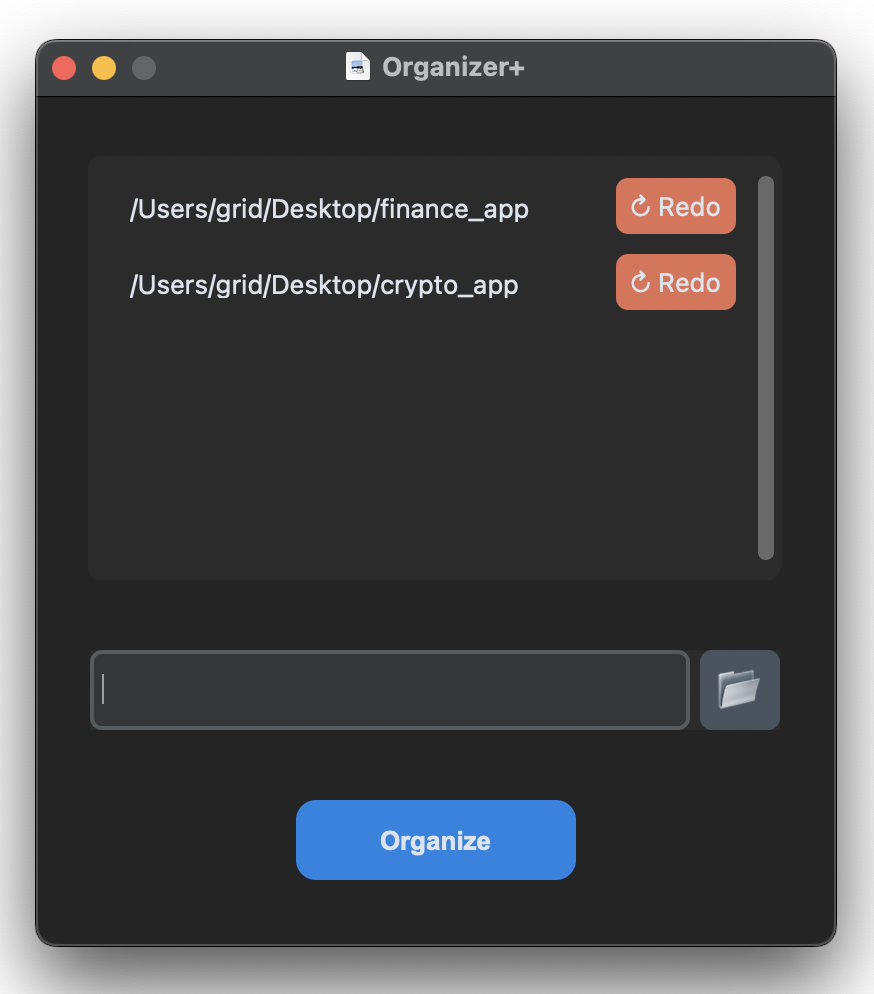

Organizer+ (File Organizer)

Organizer+ is a Python desktop application that helps you organize files by automatically creating categorized folders in a selected directory and moving files into them based on their extensions.



Features:
- Categorizes files automatically based on file extensions.
- Keeps a history of organized files and allows reorganizing.
- Simple and user-friendly graphical interface using Tkinter.

---

## **Installation & Usage**

1. **Clone the repository**:
```bash
https://github.com/gr1dsan/OrganizerPlus.git
```

2. **Enter the repo folder**:
```bash
cd OrganizerPlus
```

3. **Set up your virtual enviroment**:

For Mac/Linux:
```bash
python3 -m venv env
source env/bin/activate
```

For Windows:
```bash
python -m venv env
.\env\Scripts\activate
```

4. **Install all dependencies**:
```bash
pip install -r requirements.txt
```

5. **Run the program**:
```bash
python main.py
```
